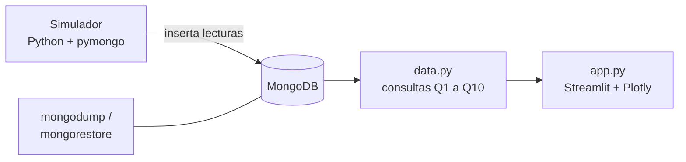

# Arquitectura

## Visión general

## Componentes

| Componente | Ubicación | Responsabilidad |
|---|---|---|
| Base de datos | MongoDB local | Almacena fincas, parcelas, nodos, lecturas, alertas, riegos y eventos |
| Esquemas e índices | `db/schemas/`, `db/indexes/` | Validaciones `$jsonSchema` e índices reproducibles |
| Seeds | `db/seeds/` | Datos iniciales, incluida la noche de helada precargada |
| Consultas | `db/queries/` | Q1 a Q10 como scripts de `mongosh` |
| Simulador | `simulator/` | Genera lecturas y escenarios; expone funciones importables |
| Dashboard | `dashboard/` | `data.py` (único acceso a MongoDB) y `app.py` (presentación) |
| Resguardo | `scripts/` | Backup y restauración |

## Decisiones de arquitectura

- **Toda consulta vive en `dashboard/data.py`.** `app.py` solo presenta. Así cada pantalla puede mostrar la consulta que la alimenta.
- **El simulador es una librería además de un script**, porque el dashboard puede invocarlo para la simulación en vivo.
- **Sin dependencias de internet.** Los mapas son polígonos en Plotly, sin mapa base.
- **Datos sintéticos etiquetados.** Cada lectura y alerta lleva `fuente` y, si corresponde, `escenario_id`.

Ver las decisiones registradas en [`decisions/`](decisions/).

## Convenciones

| Tema | Convención |
|---|---|
| Idioma | Español en documentación, comentarios y commits |
| Nombres de colecciones y campos | `snake_case`, en español, sin tildes ni eñes |
| Fechas y horas | UTC en la base; mostrar en hora de Argentina (UTC−3) en el dashboard |
| Geometrías | GeoJSON en WGS84 (longitud, latitud) |
| Secretos | Nunca en el repo (es público) |

## Entorno

MongoDB Community Server, `mongosh`, MongoDB Compass, Python 3 con entorno virtual, Streamlit y Plotly. Verificar las versiones instaladas y fijarlas en `dashboard/requirements.txt` y `simulator/requirements.txt`.

## Cómo ejecutarlo

*Se completa en el Sprint A y se actualiza en cada sprint.*
